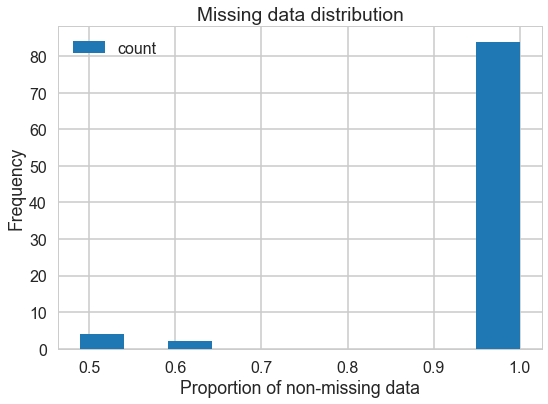
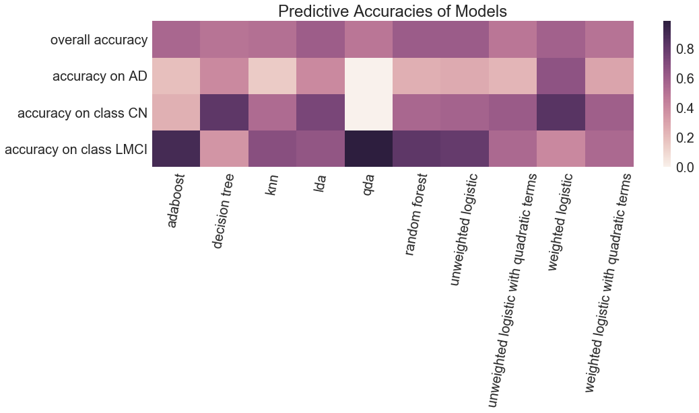
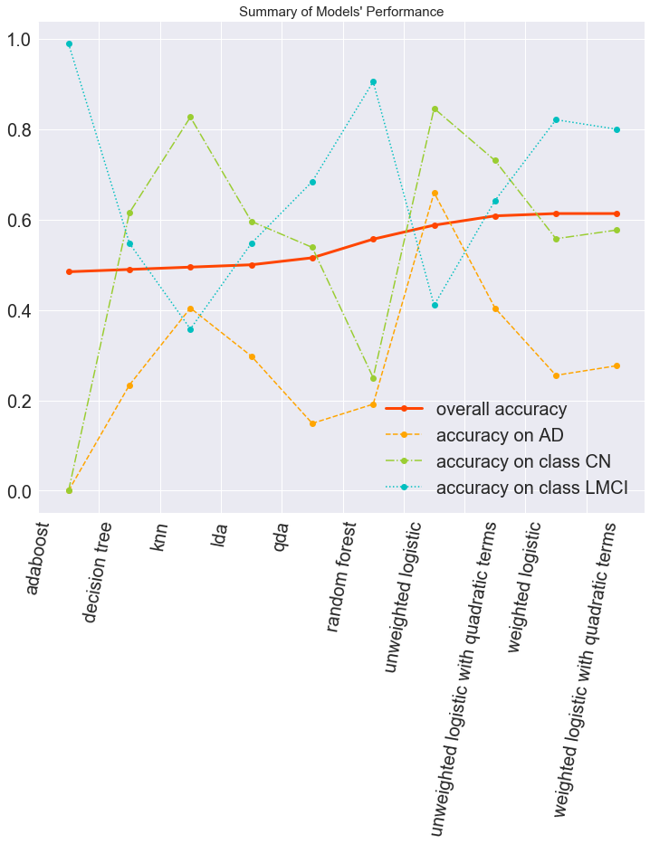
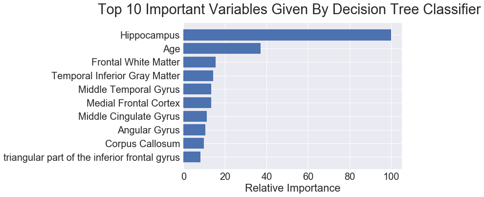
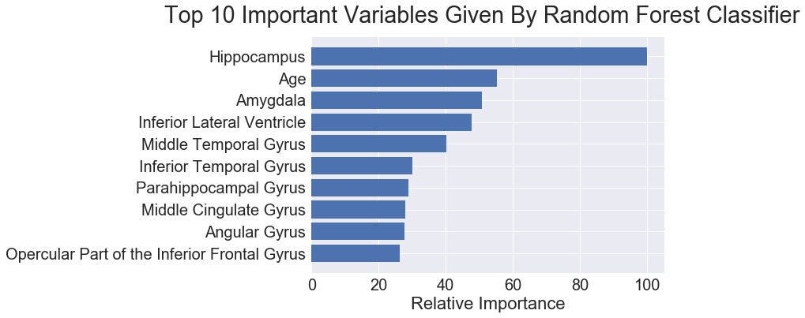
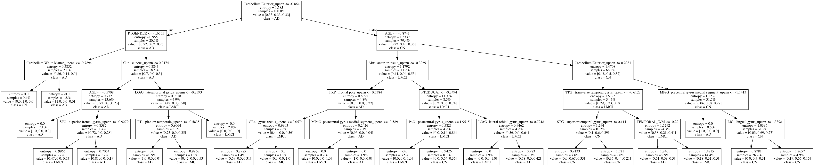

## Contents
{:.no_toc}
*  
{: toc}


## Overview

Recall that our **research quesiton** is:

Building **classifier models** for patients **baseline diagnosis** using patients **brain MRI data from their first visits**, adjusting for basic **demographic information**.

And that our **outcome variable** is **patients’ baseline diagnosis ( *DX_bl* )** that has 3 categories: 
- **CN:** the control subjects in the ADNI study. They show no signs of depression, mild cognitive impairment or dementia.
- **LMCI:** subjects that suffers from light cognitive impairment
- **AD:** participants that have been evaluated and meet the NINCDS/ADRDA criteria for probable AD

**(1) Base models**

Based on the **base set** that is extracted from **Adnimerge (ADNIMERGE.csv)**, we built **base models** including only the **4 demographic features**:

- age
- gender
- education level
- marriage status

The goal for building base model is to compare how MRI features can improve the classification accuracy of the models, thus， several basic raw models were attempted:

- decision tree	*(max_depth=20)*
- knn	*(n_neighbors=2)*
- lda	
- qda	
- unweighted logistic	*(multi_class= 'ovr')*
- unweighted logistic with quadratic terms	*(multi_class= 'ovr')*
- weighted logistic	
- weighted logistic with quadratic terms

**(2) Final models**

Based on the **final set** that is the combination of **Adnimerge (ADNIMERGE.csv)** and **UPENN(UPENNROI_MARS_06_01_16.csv)**, we built **final models** including both the **4 demographic features** and the extra **83 imaging features**. 

Except for predicting outcome with **high accuracy**, we also wish to dive deeper into the **association between imaging predictors and outcome**, thus more complicated models were attempted, and key **parameters were tuned by cross-validation**:

- tree-based models:
 - adaboost	  *(depth=1, tree_number=80, learning rate=0.05)*
 - decision tree	*(maximum depth:  5)*
 - random forest    *(via GridSearchCV)*
- non-parametric model:
 - knn	*(k=10)*
- linear and quadratic models:
 - lda	
 - qda		
 - unweighted logistic	*(cv)*
 - unweighted logistic with quadratic terms	   *(cv)*
 - weighted logistic	*(cv)*
 - weighted logistic with quadratic terms   *(cv)*

The **results** among these different models **were compared**. 

We also compared the **importance of different predictors** from tree-based models, and a **branch graph** was generated.


## Data Preprocessing 

- All **categorical** precidtors were converted into **indicator** variables.
- Our final data set doesn't suffer from serious missing data problem (Figure 1), and we **impute** all the missing values with **mean**.
- Variables were **standardized**. 
- whole data set (**762 observations**) were randomly **splitted** into test and training set (**test: training = 1:3**)

Figure 1. **Missing data distribution**





## Base Models
### Training Accuracies for Base Models


<div>
<style>
    .dataframe thead tr:only-child th {
        text-align: right;
    }

    .dataframe thead th {
        text-align: left;
    }

    .dataframe tbody tr th {
        vertical-align: top;
    }
</style>
<table border="1" class="dataframe">
  <thead>
    <tr style="text-align: right;">
      <th></th>
      <th>decision tree</th>
      <th>knn</th>
      <th>lda</th>
      <th>qda</th>
      <th>unweighted logistic</th>
      <th>unweighted logistic with quadratic terms</th>
      <th>weighted logistic</th>
      <th>weighted logistic with quadratic terms</th>
    </tr>
  </thead>
  <tbody>
    <tr>
      <th>overall accuracy</th>
      <td>0.971831</td>
      <td>0.705986</td>
      <td>0.485915</td>
      <td>0.489437</td>
      <td>0.485915</td>
      <td>0.492958</td>
      <td>0.482394</td>
      <td>0.508803</td>
    </tr>
    <tr>
      <th>accuracy on AD</th>
      <td>0.992248</td>
      <td>0.992248</td>
      <td>0.023256</td>
      <td>0.069767</td>
      <td>0.023256</td>
      <td>0.124031</td>
      <td>0.255814</td>
      <td>0.271318</td>
    </tr>
    <tr>
      <th>accuracy on class CN</th>
      <td>0.987342</td>
      <td>0.772152</td>
      <td>0.126582</td>
      <td>0.310127</td>
      <td>0.113924</td>
      <td>0.094937</td>
      <td>0.310127</td>
      <td>0.322785</td>
    </tr>
    <tr>
      <th>accuracy on class LMCI</th>
      <td>0.953737</td>
      <td>0.537367</td>
      <td>0.900356</td>
      <td>0.782918</td>
      <td>0.907473</td>
      <td>0.886121</td>
      <td>0.683274</td>
      <td>0.722420</td>
    </tr>
  </tbody>
</table>
</div>


### Test Accuracies for Base Models


<div>
<style>
    .dataframe thead tr:only-child th {
        text-align: right;
    }

    .dataframe thead th {
        text-align: left;
    }

    .dataframe tbody tr th {
        vertical-align: top;
    }
</style>
<table border="1" class="dataframe">
  <thead>
    <tr style="text-align: right;">
      <th></th>
      <th>decision tree</th>
      <th>knn</th>
      <th>lda</th>
      <th>qda</th>
      <th>unweighted logistic</th>
      <th>unweighted logistic with quadratic terms</th>
      <th>weighted logistic</th>
      <th>weighted logistic with quadratic terms</th>
    </tr>
  </thead>
  <tbody>
    <tr>
      <th>overall accuracy</th>
      <td>0.371134</td>
      <td>0.402062</td>
      <td>0.463918</td>
      <td>0.448454</td>
      <td>0.453608</td>
      <td>0.453608</td>
      <td>0.402062</td>
      <td>0.422680</td>
    </tr>
    <tr>
      <th>accuracy on AD</th>
      <td>0.319149</td>
      <td>0.489362</td>
      <td>0.042553</td>
      <td>0.042553</td>
      <td>0.021277</td>
      <td>0.042553</td>
      <td>0.191489</td>
      <td>0.148936</td>
    </tr>
    <tr>
      <th>accuracy on class CN</th>
      <td>0.326923</td>
      <td>0.519231</td>
      <td>0.038462</td>
      <td>0.211538</td>
      <td>0.038462</td>
      <td>0.057692</td>
      <td>0.250000</td>
      <td>0.307692</td>
    </tr>
    <tr>
      <th>accuracy on class LMCI</th>
      <td>0.421053</td>
      <td>0.294737</td>
      <td>0.905263</td>
      <td>0.778947</td>
      <td>0.894737</td>
      <td>0.873684</td>
      <td>0.589474</td>
      <td>0.621053</td>
    </tr>
  </tbody>
</table>
</div>


### Summary
- (1)Overfitting models
 - knn
 - decisoin trees
We can see, the training accuracy of tree-based model and non-parametric model above are significantly higher than other models, but the test accuracy of them are lower than others. This idicating overfitting problem, informing us to fine-tune the parameters of final models.


- (2) **Overall test accuraccy** of all base models **centered at 0.4**, which is low.


- (3) Test accuraccy on **class LMCI is much higher** than AD and CN, however, we are more interested in test accuracy on AD. This give us hints to use **weighted method to put more weight on AD**, which has smallest protion in the three classes.

## Final models
### Training Accuracy for Final Models


<div>
<style>
    .dataframe thead tr:only-child th {
        text-align: right;
    }

    .dataframe thead th {
        text-align: left;
    }

    .dataframe tbody tr th {
        vertical-align: top;
    }
</style>
<table border="1" class="dataframe">
  <thead>
    <tr style="text-align: right;">
      <th></th>
      <th>adaboost</th>
      <th>decision tree</th>
      <th>knn</th>
      <th>lda</th>
      <th>qda</th>
      <th>random forest</th>
      <th>unweighted logistic</th>
      <th>unweighted logistic with quadratic terms</th>
      <th>weighted logistic</th>
      <th>weighted logistic with quadratic terms</th>
    </tr>
  </thead>
  <tbody>
    <tr>
      <th>overall accuracy</th>
      <td>0.600352</td>
      <td>0.647887</td>
      <td>0.630282</td>
      <td>0.709507</td>
      <td>0.795775</td>
      <td>0.869718</td>
      <td>0.683099</td>
      <td>0.948944</td>
      <td>0.642606</td>
      <td>0.977113</td>
    </tr>
    <tr>
      <th>accuracy on AD</th>
      <td>0.279070</td>
      <td>0.806202</td>
      <td>0.364341</td>
      <td>0.635659</td>
      <td>1.000000</td>
      <td>0.767442</td>
      <td>0.418605</td>
      <td>0.821705</td>
      <td>0.759690</td>
      <td>0.953488</td>
    </tr>
    <tr>
      <th>accuracy on class CN</th>
      <td>0.310127</td>
      <td>0.854430</td>
      <td>0.639241</td>
      <td>0.683544</td>
      <td>0.272152</td>
      <td>0.759494</td>
      <td>0.683544</td>
      <td>0.962025</td>
      <td>0.841772</td>
      <td>0.955696</td>
    </tr>
    <tr>
      <th>accuracy on class LMCI</th>
      <td>0.911032</td>
      <td>0.459075</td>
      <td>0.747331</td>
      <td>0.758007</td>
      <td>0.996441</td>
      <td>0.978648</td>
      <td>0.804270</td>
      <td>1.000000</td>
      <td>0.476868</td>
      <td>1.000000</td>
    </tr>
  </tbody>
</table>
</div>


### Test Accuracy for Final Models


```python
df_eva_test
```


<div>
<style>
    .dataframe thead tr:only-child th {
        text-align: right;
    }

    .dataframe thead th {
        text-align: left;
    }

    .dataframe tbody tr th {
        vertical-align: top;
    }
</style>
<table border="1" class="dataframe">
  <thead>
    <tr style="text-align: right;">
      <th></th>
      <th>adaboost</th>
      <th>decision tree</th>
      <th>knn</th>
      <th>lda</th>
      <th>qda</th>
      <th>random forest</th>
      <th>unweighted logistic</th>
      <th>unweighted logistic with quadratic terms</th>
      <th>weighted logistic</th>
      <th>weighted logistic with quadratic terms</th>
    </tr>
  </thead>
  <tbody>
    <tr>
      <th>overall accuracy</th>
      <td>0.556701</td>
      <td>0.494845</td>
      <td>0.515464</td>
      <td>0.608247</td>
      <td>0.484536</td>
      <td>0.613402</td>
      <td>0.613402</td>
      <td>0.489691</td>
      <td>0.587629</td>
      <td>0.500000</td>
    </tr>
    <tr>
      <th>accuracy on AD</th>
      <td>0.191489</td>
      <td>0.404255</td>
      <td>0.148936</td>
      <td>0.404255</td>
      <td>0.000000</td>
      <td>0.255319</td>
      <td>0.276596</td>
      <td>0.234043</td>
      <td>0.659574</td>
      <td>0.297872</td>
    </tr>
    <tr>
      <th>accuracy on class CN</th>
      <td>0.250000</td>
      <td>0.826923</td>
      <td>0.538462</td>
      <td>0.730769</td>
      <td>0.000000</td>
      <td>0.557692</td>
      <td>0.576923</td>
      <td>0.615385</td>
      <td>0.846154</td>
      <td>0.596154</td>
    </tr>
    <tr>
      <th>accuracy on class LMCI</th>
      <td>0.905263</td>
      <td>0.357895</td>
      <td>0.684211</td>
      <td>0.642105</td>
      <td>0.989474</td>
      <td>0.821053</td>
      <td>0.800000</td>
      <td>0.547368</td>
      <td>0.410526</td>
      <td>0.547368</td>
    </tr>
  </tbody>
</table>
</div>


### Summary
- **(1) weighted methods** fitts **better** for this unbalanced data set (*Figure 2*):

**Weighted logistic** classifier has the **highest test accuracy on AD**, this is because the proportion of the three classes are heavily unbalnced, where **AD has the smallest portion** and **LMCI has the largest portion**.

- **(2) linear methods** can **better** describe association between MRI data and diagnosis (*Figure 2*):
 - The test accuraccy on **lda(linear**) is much **higher than qda(quadratic)**; 
 - The test accuraccy on **(weighted) linear logistic** is much **higher than (weighted) quadratic logistic**;
 
This result indicating that MRI and diagnosis **are more likely to follow linear relationship**. 

- **(3) Overall** test accuracy **varies much less** than **seperate** accuracy accross different classifiers, we can select different classifier according to specific need (*Figure 3*):
 - **To better predict AD:** **weighted logistic** > lda = decision tree
 - **To better predict CN:** **weighted logistic** ~ decision tree > lda
 - **To better predict LMCI:** qda ~ adaboost > random forest ~ **weighted logistic**
 
Based on test accuracy on all the three classes seperately, we strongly recommend **weighted logistic** classifier.

Figure 2. **Heatmap for Predictive Accuracies of Models**





Figure 3. **Scatter plot for Predictive Accuracies of Models**





### Importance of variables

Based on the importance sequence generated by two different tree-based classifier, we can see:

- **Hippocampus** is the **most important** predictor for cognitive impairment diagnosis
- **Age** also plays an important role in the prediction, and should be adjusted when analysing imaging data.
- **Middle Cingulate Gyrus**, **Middle Temporal Gyrus** and **Angular Gyrus** are also important predictors


Figure 4. **Top 10 Important Variables Given By Decision Tree Classifier**





Figure 5. **Top 10 Important Variables Given By Random Forest Classifier**





Figure 6. **Tree graph for important predictors**





## Final-Base Model Comparing

By comparing base models and final models, we can see:

MRI data significantly increase the test accuracy of all the models.
